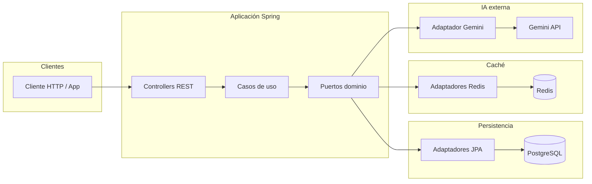

# Arquitectura

## Patrón: hexagonal (puertos y adaptadores)

La lógica de negocio no depende de Spring, de la base de datos ni de Gemini: habla solo con **interfaces (puertos)**. Quien implementa esos puertos son los **adaptadores** en infraestructura (REST entrante, JPA saliente, cliente HTTP a Gemini, Redis).

## Capas

| Capa | Ubicación típica | Rol |
| --- | --- | --- |
| **Dominio** | `com.gastromind.api.domain` | Modelos de negocio, excepciones de dominio, contratos `ports/in` y `ports/out`. Sin frameworks. |
| **Aplicación** | `com.gastromind.api.application` | Casos de uso (`usecases`), servicios que orquestan puertos y reglas que atraviesan varios agregados. |
| **Infraestructura** | `com.gastromind.api.infrastructure` | Adaptadores: REST (`adapters/in/rest`), SOAP JAX-WS (`adapters/in/soap`, Apache CXF), JPA (`adapters/out/persistence/jpa`), caché Redis (`adapters/out/cache`), IA (`adapters/out/ai`), seguridad JWT (`infrastructure/security`). |

El paquete `application/services` concentra implementaciones de puertos de entrada (`ports/in`) cuando el proyecto usa servicios como fachada entre controladores y casos de uso.

## Diagrama de componentes (flujo de datos)

El núcleo fluye desde la base relacional y la caché hacia la API HTTP. Gemini es un adaptador de salida invocado por los casos de uso que lo necesiten.

MongoDB está definido en Docker Compose y como dependencia Maven, pero **no hay adaptadores Mongo en el código de aplicación actual**: el diagrama no lo incluye hasta que exista un puerto implementado contra Mongo.

Los **endpoints SOAP** comparten el mismo proceso HTTP que REST; delegan en los servicios de aplicación (`*ServiceImpl`) para catálogos de solo lectura. Contrato y pruebas manuales se documentan en [SOAP.md](SOAP.md).

## Decisiones de diseño (ADR)

### ADR-001: Puertos para IA frente a proveedor concreto

- **Contexto:** La generación de recetas y la extracción de tickets dependen de un modelo externo que puede cambiar de proveedor o de API.
- **Decisión:** El dominio define puertos como `RecipeAiPort` y `TicketExtractionPort`; la implementación concreta vive en `GeminiRecipeAdapter` y `GeminiTicketExtractionAdapter`.
- **Consecuencias:** Cambiar de Gemini a otro proveedor implica nuevo adaptador y configuración, sin tocar casos de uso que solo conocen el puerto.

### ADR-002: Redis para caché y límites operativos

- **Contexto:** Sugerencias de receta y flujos de tienda necesitan TTL y deduplicación sin cargar Postgres en cada petición repetida.
- **Decisión:** Propiedades bajo `app.ai.suggestion-cache`, `app.store.pending-cache` y `app.store.alias-rate-limit` apuntan a prefijos y TTL en Redis mediante adaptadores en `adapters/out/cache`.
- **Consecuencias:** Redis es obligatorio para esos caminos; el arranque local debe incluir Redis junto a Postgres.

### ADR-003: Actuator + formato Prometheus

- **Contexto:** Operaciones necesitan salud y métricas sin acoplarse a un vendor de APM concreto en el primer paso.
- **Decisión:** Spring Boot Actuator con endpoint Prometheus de Micrometer; scrape desde Prometheus en desarrollo (véase [OBSERVABILITY.md](OBSERVABILITY.md)).
- **Consecuencias:** Métricas HTTP y JVM estándar; dashboards avanzados quedan fuera hasta integrar otro stack.

### ADR-004: API REST autenticada con JWT stateless

- **Contexto:** Clientes móviles o SPAs contra una API sin sesión de servidor.
- **Decisión:** Spring Security con filtros JWT; rutas públicas configuradas explícitamente (auth, OpenAPI, actuator según configuración actual).
- **Consecuencias:** Sin estado en servidor para sesiones; revocación de tokens requiere estrategia adicional si se exige más adelante.

### ADR-005: SOAP con CXF para catálogos de consulta

- **Contexto:** Hace falta exponer más de un servicio SOAP (requisito externo o académico) sin duplicar reglas de negocio ni acoplar el dominio a XML.
- **Decisión:** Apache CXF (`cxf-spring-boot-starter-jaxws`) con endpoints JAX-WS bajo `cxf.path=/soap`, implementaciones en `infrastructure.adapters.in.soap` que llaman a los mismos `*ServiceImpl` que ya implementan puertos de entrada; operaciones de **solo lectura** (listar / obtener por id) y DTOs JAXB dedicados.
- **Consecuencias:** Rutas `/soap/**` deben figurar como públicas si no se integra JWT en el mensaje SOAP; el front principal no depende de este canal. Detalle operativo en [SOAP.md](SOAP.md).
