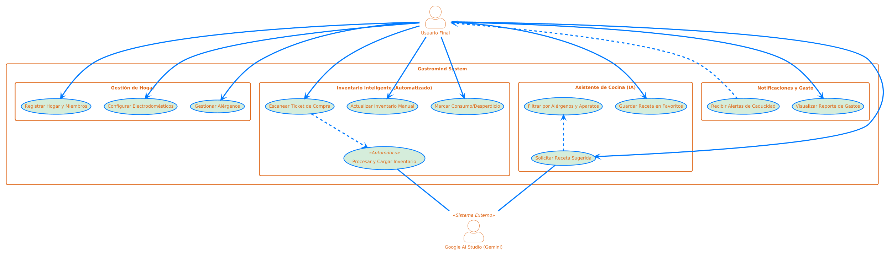
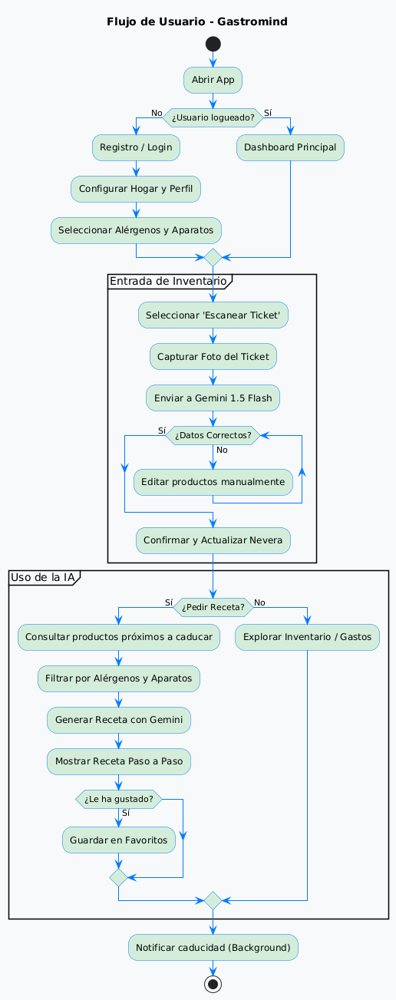
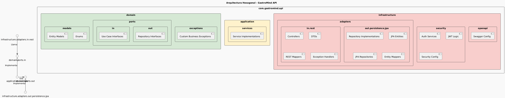



# Especificacion de Casos de Uso - Gastromind

### CU-01: Escaneo de Ticket e Inventariado Automatico

| Campo | Detalle |
| --- | --- |
| **Nombre** | **Escanear Ticket de Compra** |
| **ID** | CU-01 |
| **Actor Principal** | Usuario Final |
| **Actores Secundarios** | Google AI Studio (Gemini 1.5 Flash) |
| **Descripcion** | El usuario captura una imagen de un ticket fisico. La IA procesa el texto, identifica productos y los inserta automaticamente en la base de datos. |
| **Precondiciones** | Usuario autenticado y con un `household_id` valido. |
| **Flujo Principal** | 1. El usuario activa la camara desde la App. 2. Se envia la imagen al Backend. 3. El Backend solicita extraccion de datos a Gemini. 4. Gemini devuelve JSON con: nombre, cantidad, precio y categoria. 5. El sistema registra el `ticket` y crea los `fridge_items`. 6. Se confirma la carga al usuario. |
| **Postcondicion** | Los productos aparecen en la vista de "Nevera" y el gasto se refleja en el reporte mensual. |

---

### CU-02: Sugerencia de Receta Inteligente (IA) 

| Campo | Detalle |
| --- | --- |
| **Nombre** | **Solicitar Receta Sugerida** |
| **ID** | CU-02 |
| **Actor Principal** | Usuario Final |
| **Actores Secundarios** | Google AI Studio (Gemini) |
| **Descripcion** | El sistema genera una receta personalizada basada exclusivamente en los ingredientes disponibles, alergenos y electrodomesticos del hogar. |
| **Precondiciones** | Existencia de productos en la tabla `fridge_items`. |
| **Flujo Principal** | 1. El usuario solicita una sugerencia. 2. El sistema recupera productos proximos a caducar. 3. El sistema recupera alergenos (`user_allergens`) y aparatos (`household_appliances`). 4. Gemini procesa el contexto y genera la receta. 5. El sistema presenta la receta con instrucciones y tiempo de preparacion. |
| **Postcondicion** | El usuario visualiza una receta segura y ejecutable con su equipamiento actual. |

---

### CU-03: Alerta de Caducidad Proactiva

| Campo | Detalle |
| --- | --- |
| **Nombre** | **Recibir Alerta de Caducidad** |
| **ID** | CU-03 |
| **Actor Principal** | Sistema Gastromind (Automatizado) |
| **Actor Pasivo** | Usuario Final |
| **Descripcion** | El sistema monitoriza las fechas de caducidad y notifica al usuario para evitar el desperdicio de alimentos. |
| **Flujo Principal** | 1. El sistema ejecuta un proceso programado diario. 2. Filtra productos con `expiration_date` < 48 horas y `status` = 'disponible'. 3. Se dispara una notificacion push al dispositivo del usuario. 4. El usuario accede a la app para ver el producto en riesgo. |
| **Postcondicion** | Se reduce el indice de `status` = 'desperdiciado' en la base de datos. |

---

### CU-04: Gestion de Preferencias y Seguridad

| Campo | Detalle |
| --- | --- |
| **Nombre** | **Gestionar Alergenos y Electrodomesticos** |
| **ID** | CU-04 |
| **Actor Principal** | Usuario Final |
| **Descripcion** | El usuario define las limitaciones medicas y el equipamiento tecnico de su cocina para filtrar la logica de la IA. |
| **Flujo Principal** | 1. El usuario accede a "Ajustes de Cocina". 2. Selecciona alergenos de la tabla `allergen`. 3. Marca los electrodomesticos activos (`appliance_type`). 4. El sistema actualiza las tablas `user_allergens` y `household_appliances`. |
| **Postcondicion** | La IA ajusta el filtrado de recetas en tiempo real para futuras consultas. |

## Explicacion Detallada del Flujo de Trabajo (Diagrama de flujo)

El ecosistema de **Gastromind** conecta al usuario con la inteligencia artificial de Gemini a traves de cuatro procesos principales:

#### 1. Entrada de Datos: Digitalizacion del Inventario (CU-01)
Todo comienza cuando el usuario adquiere nuevos productos. En lugar de introducirlos manualmente:
*   **Accion:** Se escanea el ticket de compra fisico desde la aplicacion.
*   **Proceso:** El backend actua como orquestador, enviando la imagen a **Gemini 1.5 Flash**.
*   **Resultado:** La IA extrae los datos (nombre, cantidad, precio, categoria) y el sistema los inserta en la base de datos vinculados al hogar (`household_id`), alimentando el inventario de la "Nevera".

#### 2. Gestion Inteligente y Alertas (CU-03)
El sistema monitoriza el inventario de forma proactiva para evitar el desperdicio:
*   **Accion:** Una tarea programada (cron job) se ejecuta diariamente.
*   **Logica:** Filtra productos con `expiration_date` proximo (menos de 48 horas) y estado "disponible".
*   **Resultado:** Se dispara una **notificacion push** al dispositivo del usuario, permitiendole reaccionar antes de que la comida se pierda.

#### 3. Personalizacion y Restricciones (CU-04)
Para que las sugerencias sean seguras y utiles, el sistema integra el perfil tecnico del hogar:
*   **Configuracion:** El usuario gestiona sus **alergenos** medicos y los **electrodomesticos** disponibles (horno, freidora de aire, etc.).
*   **Importancia:** Estos datos actuan como filtros criticos que el sistema inyecta en el "prompt" de la IA para garantizar que las recetas sean ejecutables y seguras.

#### 4. Generacion de Recetas con IA (CU-02)
Este es el punto de salida principal donde se genera valor directo:
*   **Peticion:** El usuario solicita una sugerencia de cocina.
*   **Contexto:** El sistema cruza tres fuentes de datos:
    1.  **Inventario:** Productos disponibles y especialmente aquellos proximos a caducar.
    2.  **Seguridad:** Alergenos configurados por el usuario.
    3.  **Capacidad:** Electrodomesticos activos en la cocina.
*   **Proceso:** Gemini procesa este contexto filtrado para generar una receta paso a paso.
*   **Resultado:** El usuario recibe una receta personalizada, segura y optimizada para consumir lo que ya tiene en casa.

## Explicacion de la estructura del proyecto (Diagrama de Paquetes)

El proyecto esta organizado siguiendo el principio de **separacion de intereses** para asegurar que la logica de negocio sea independiente de la tecnologia:

1. **Dominio (`domain`)**: Es el corazon del sistema. Contiene los modelos de negocio (como `Product`, `FridgeItem`), las excepciones personalizadas (`NotFoundException`, `AllergenRiskException`) y los **Puertos** (interfaces). Los puertos definen *que* puede hacer el sistema sin decir *como* se hace.
2. **Aplicacion (`application`)**: Aqui residen los servicios (`ServiceImpl`). Estos orquestan la logica de negocio implementando las interfaces de entrada y comunicandose con los puertos de salida (repositorios).
3. **Infraestructura (`infrastructure`)**: Contiene los detalles tecnicos y adaptadores:
* **Adaptadores de Entrada (`in.rest`)**: Controladores que exponen la API y DTOs para el intercambio de datos con el cliente.
* **Adaptadores de Salida (`out.persistence`)**: Implementaciones de base de datos usando JPA, Entidades y Mappers para transformar datos entre la DB y el Dominio.
* **Seguridad**: Toda la configuracion de autenticacion JWT y proteccion de rutas.

4. **Mappers**: Utilizamos MapStruct de forma extensiva en dos niveles para mantener el desacoplamiento: uno para la persistencia (Entidad a Dominio) y otro para la API (Dominio a DTO).

